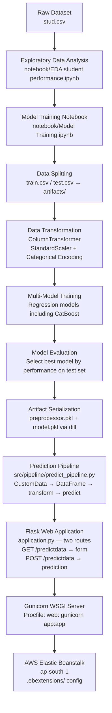

# Student Math Score Predictor — End-to-End ML Regression Pipeline


🚀 **Live Demo:** [http://end-to-end-ml-env.eba-mmsramda.ap-south-1.elasticbeanstalk.com](http://end-to-end-ml-env.eba-mmsramda.ap-south-1.elasticbeanstalk.com)

🔗 **GitHub Repository:** [https://github.com/24f2006816/end_to_end_ml_project](https://github.com/24f2006816/end_to_end_ml_project)

---

## Project Overview

This project implements a complete machine learning engineering workflow — from raw data and exploratory analysis through preprocessing, multi-model training, artifact serialization, and a live cloud-deployed inference endpoint.

The system predicts a student's **math score** (regression) from demographic and academic inputs: gender, race/ethnicity, parental level of education, lunch type, test preparation course, reading score, and writing score.

What makes this an end-to-end ML engineering project rather than a notebook exercise:

- The **preprocessing pipeline** (`ColumnTransformer`) is fitted during training and serialized separately from the model — enforcing train-serve consistency at inference time and preventing data leakage.
- The **`src/` directory is structured as an installable Python package** (via `setup.py`), with modular components for pipeline logic, custom exception handling, and structured logging.
- The **Flask app has dedicated development and production entry points**, with the production file (`application.py`) using AWS Elastic Beanstalk's required WSGI object naming convention.
- The application is **deployed live on AWS Elastic Beanstalk** (ap-south-1), served by Gunicorn, and configured via `Procfile` and `.ebextensions/`.

---

## Key Features

- **Decoupled preprocessing artifact** — `preprocessor.pkl` (scikit-learn `ColumnTransformer`) serialized independently from `model.pkl`, loaded together at inference to guarantee consistent feature transforms
- **`dill`-based serialization** — used instead of `pickle` to reliably serialize pipeline objects that contain custom Python classes
- **Modular `src/` package** — `exception.py` (custom exception class with traceback context), `logger.py` (timestamped file-based logging), `utils.py` (shared utility functions), structured under a `setup.py`-installable layout
- **`CustomData` + `PredictPipeline` classes** — `CustomData` maps raw HTML form inputs to a structured DataFrame; `PredictPipeline` loads both artifacts and returns predictions — cleanly separating web layer from ML logic
- **Two Flask entry points** — `app.py` for local development (debug mode on), `application.py` for production (debug off, `application` WSGI object for EB compatibility)
- **AWS Elastic Beanstalk deployment** — environment configuration via `.ebextensions/`, `.ebignore` to exclude unnecessary files from deployment bundles
- **Gunicorn WSGI server** — process managed via `Procfile` (`web: gunicorn app:app`)
- **EDA + model training notebooks** — `EDA student performance.ipynb` and `Model Training.ipynb` in `/notebook/`, with CatBoost among the models evaluated during training

---

## Machine Learning Workflow



### Stage-by-Stage Summary

| Stage | What happens |
|---|---|
| **Raw Data** | `stud.csv` — tabular student records with 7 features and 1 numeric target (math score) |
| **EDA** | Univariate and bivariate analysis of feature distributions and correlations with math score |
| **Data Transformation** | `ColumnTransformer` applies `StandardScaler` to numeric features and encoding to categoricals; fitted on train split only |
| **Model Training** | Multiple regression models trained and compared; CatBoost confirmed among those evaluated |
| **Model Evaluation** | Best-performing model selected based on evaluation on held-out test set |
| **Serialization** | Both `preprocessor.pkl` and `model.pkl` serialized using `dill` and stored in `artifacts/` |
| **Prediction Pipeline** | `CustomData` converts form input to a DataFrame; `PredictPipeline` loads both artifacts, applies the preprocessor, returns the score |
| **Flask App** | Two routes: `/` (landing page) and `/predictdata` (GET: form, POST: inference result) |
| **Gunicorn** | Production WSGI server; process defined in `Procfile` |
| **AWS EB** | Live deployment on Elastic Beanstalk (ap-south-1); environment configured via `.ebextensions/` |

---

## Project Architecture

```text
end_to_end_ml_project/
│
├── src/                              # Installable Python package (setup.py)
│   ├── __init__.py
│   ├── exception.py                  # Custom exception class with full traceback context
│   ├── logger.py                     # Timestamped file-based logging configuration
│   ├── utils.py                      # Shared utility functions
│   └── pipeline/
│       ├── __init__.py
│       └── predict_pipeline.py       # CustomData + PredictPipeline inference classes
│
├── notebook/                         # Training-time exploration (not shipped to production)
│   ├── data/
│   │   └── stud.csv                  # Source dataset
│   ├── EDA student performance.ipynb # Exploratory data analysis
│   └── Model Training.ipynb          # Multi-model training and evaluation
│
├── artifacts/                        # Serialized pipeline artifacts
│   ├── model.pkl                     # Trained regression model (dill)
│   ├── preprocessor.pkl              # Fitted ColumnTransformer (dill)
│   ├── data.csv                      # Full processed dataset
│   ├── train.csv                     # Training split
│   └── test.csv                      # Test split
│
├── templates/                        # Jinja2 HTML templates
│   ├── index.html                    # Landing page
│   └── home.html                     # Prediction form + result display
│
├── catboost_info/                    # CatBoost training logs (generated during training)
│
├── .ebextensions/                    # AWS Elastic Beanstalk environment configuration
├── app.py                            # Flask app — development entry point (debug=True)
├── application.py                    # Flask app — production entry point (EB WSGI convention)
├── Procfile                          # Process definition: web: gunicorn app:app
├── .ebignore                         # Files excluded from EB deployment bundle
├── requirements.txt                  # Runtime dependencies
├── setup.py                          # Package installation config (find_packages on src/)
└── .gitignore
```

---

## Tech Stack

| Layer | Technology |
|---|---|
| Language | Python 3.11 |
| ML / Preprocessing | scikit-learn (`ColumnTransformer`, `StandardScaler`), CatBoost (training) |
| Data | Pandas, NumPy |
| Serialization | dill |
| Web Framework | Flask |
| WSGI Server | Gunicorn |
| Cloud Platform | AWS Elastic Beanstalk (ap-south-1) |
| Deployment Config | Procfile, `.ebextensions/`, `.ebignore` |
| Notebooks | Jupyter |

---

## Input Features

| Feature | Type | Description |
|---|---|---|
| `gender` | Categorical | Student's gender |
| `race_ethnicity` | Categorical | Student's ethnic group |
| `parental_level_of_education` | Categorical | Highest education level of parent/guardian |
| `lunch` | Categorical | Standard or free/reduced lunch |
| `test_preparation_course` | Categorical | Completed or not completed |
| `reading_score` | Numeric | Reading test score (0–100) |
| `writing_score` | Numeric | Writing test score (0–100) |

**Target:** `math_score` — continuous numeric value, treated as a regression problem.

---

## Local Setup

**Prerequisites:** Python 3.11, `pip`

```bash
# 1. Clone the repository
git clone https://github.com/24f2006816/end_to_end_ml_project.git
cd end_to_end_ml_project

# 2. Create and activate a virtual environment
python -m venv venv
source venv/bin/activate        # Windows: venv\Scripts\activate

# 3. Install dependencies (installs src/ as a package via setup.py)
pip install -r requirements.txt

# 4. Run the development server
python app.py
```

Open your browser at `http://localhost:5000`

> The `artifacts/` directory (with `model.pkl` and `preprocessor.pkl`) is committed to the repository, so inference works immediately after install.

---

## Deployment — AWS Elastic Beanstalk

The application is deployed on AWS Elastic Beanstalk (ap-south-1 region) using Python 3.11.

**Key deployment decisions:**

- `application.py` is the production entry point. The Flask app object is named `application` (not `app`) to satisfy EB's WSGI auto-detection requirement.
- `Procfile` defines the web process: `web: gunicorn app:app`
- `.ebextensions/` contains environment-level configuration applied during EB platform initialization.
- `.ebignore` excludes local development artifacts (notebooks, virtual environments, etc.) from the deployment bundle.

**To deploy your own instance:**

```bash
# Install the EB CLI
pip install awsebcli

# Initialize (select Python 3.11 platform)
eb init

# Create and deploy environment
eb create your-env-name
eb deploy
```

---

## Project Structure Rationale

| Decision | Reason |
|---|---|
| `preprocessor.pkl` separate from `model.pkl` | Ensures the same fitted transforms are applied at inference as during training — prevents train-serve skew |
| `dill` instead of `pickle` | Handles serialization of objects containing lambda functions or custom classes that `pickle` cannot serialize reliably |
| `src/` as installable package | Enables clean imports (`from src.pipeline.predict_pipeline import ...`) and enforces separation between training-time and serving-time code |
| `application.py` as production entry | AWS Elastic Beanstalk's Python platform looks specifically for a WSGI callable named `application`; using `app` causes deployment failures |
| Custom `exception.py` | Captures file name, line number, and error message into a structured exception message, making runtime errors traceable without a debugger |

---

## Repository

**GitHub:** [https://github.com/24f2006816/end_to_end_ml_project](https://github.com/24f2006816/end_to_end_ml_project)

**Author:** Pratyaksh Pandey
B.Sc. Data Science & Applications, IIT Madras

---

*Built to demonstrate the full ML engineering lifecycle — from raw data through a live, cloud-deployed inference endpoint.*
